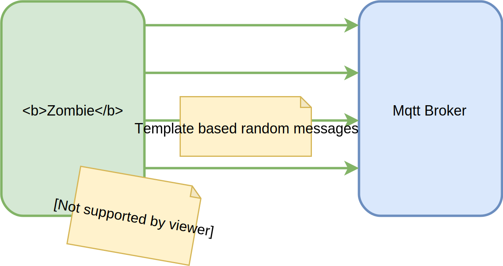
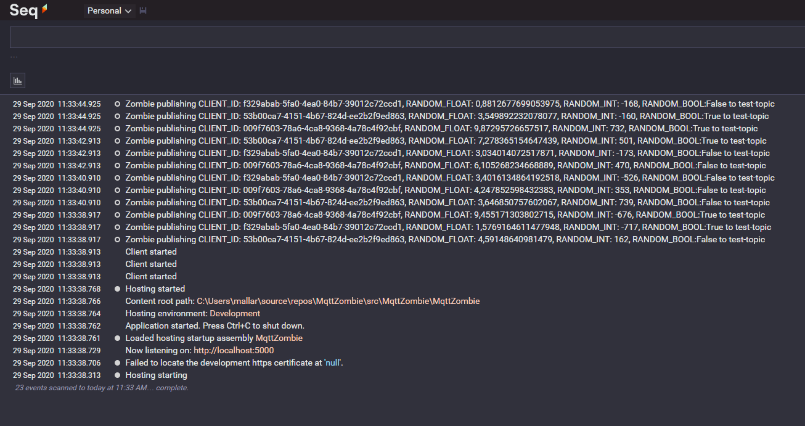

# Mqtt Zombie

Highly configurable Mqtt stresstester service with random data generation functionality 


<p align="center">
  
</p>

## [Docker](https://hub.docker.com/r/mallar/mqtt-zombie) example

```yaml
zombie:
  image: mallar/mqtt-zombie
  container_name: mqtt-zombie
  restart: always
  volumes:
    - ./appsettings.json:/app/appsettings.json
```

<p align="center">
  
</p>

## Settings

When running the image, best practice to volume in the appsettings.json

Example _appsettings.json_:

```json
{
  "Logging": {
    "Console": {
      "Level": "Information"
    },
    "Seq": {
      "Level": "Verbose",
      "Host": "http://localhost:5341"
    }
  },
  "MqttBrokerSettings": {
    "Host": "localhost",
    "Port": 1883,
    "Tls": true,
    "User": "guest",
    "Password": "guest"
  },
  "MqttClientSettings": {
    "TotalClients": 3,
    "Frequency": 30,
    "Payload": "CLIENT_ID: {{CLIENT_ID}}, RANDOM_FLOAT: {{RANDOM_FLOAT}}, RANDOM_INT: {{RANDOM_INT}}, RANDOM_BOOL:{{RANDOM_BOOL}}",
    "Topic": "test-topic",
    "Retain": false,
    "Qos": 0
  },
  "TemplateVariables": {
    "Variables": [
      {
        "Name": "CLIENT_ID",
        "ClientRandom": true
      },
      {
        "Name": "RANDOM_FLOAT",
        "Min": 0.0,
        "Max": 10.5
      },
      {
        "Name": "RANDOM_INT",
        "Min": -1000,
        "Max": 1000
      },
      {
        "Name": "RANDOM_BOOL",
        "Min": false,
        "Max": true
      }
    ]
  }
}
```

### About the settings

|Value|Default|Note|
|-----|-------|----|
|Logging:Console:Level|Information|Logging level for console. Could be Verbose, Debug, Information, Warning, Error |
|Logging:Seq:Level|Debug|Same as the console's level, but to Seq|
|Logging:Seq:Host||If set, application uses [Seq](https://datalust.co/seq) for logging besides console|
|MqttBrokerSettings:Host|localhost|Host of mqtt broker|
|MqttBrokerSettings:Port|1883|Port of mqtt broker|
|MqttBrokerSettings:Tls|false|Is tls enabled on the broker (also trusts invalid certificates)|
|MqttBrokerSettings:User|guest|User for mqtt broker|
|MqttBrokerSettings:Password|guest|Password for mqtt broker|
|MqttClientSettings:TotalClients|1|How many zombi client will start when the service is up.|
|MqttClientSettings:Frequency|60|Frequency of sendings (msg/min/client).|
|MqttClientSettings:Payload|""|Any payload text, It could contains variables like {{VARIABLE}} and it will changed dynamically during the sending |
|MqttClientSettings:Topic|""|Any topic text, It could contains variables like {{VARIABLE}} and it will changed dynamically during the sending |
|MqttClientSettings:Retain|false| Message retain |
|MqttClientSettings:Qos|false| Message Qos level |
|TemplateVariables|| See below |

### About the TemplateVariables
You can create template variables and use them in the Payload and Topic texts. Creating a variable is for randomizing the payload and even the topics if needed. These are the available Variables right now (examples):

Number variable. This will roll a random integer number between [Min..Max] 
``` json
{
    "Name": "RANDOM_NUM_VARIABLE_NAME",
    "Min": -50,
    "Max": 50
}
```

Float variable. This will roll a random float number between [Min..Max] 
``` json
{
    "Name": "RANDOM_FLOAT_VARIABLE_NAME",
    "Min": 10.0,
    "Max": 30.0
}
```

Bool variable. This will roll a random bool 
``` json
{
    "Name": "RANDOM_BOOL_VARIABLE_NAME",
    "Min": false,
    "Max": true
}
```
Text variable. This will roll random string 
``` json
{
    "Name": "RANDOM_BOOL_VARIABLE_NAME"
}
```
Every variable can have an optional _ClientRandom_ parameter, what means, that variable will be randomized only the first time, between clients. This is useful, when generating for example random names for clients, what should be the same per session per client.

``` json
{
    "Name": "CLIENT_ID",
    "ClientRandom": true
}
```
You can run the example by:
```
// Build image locally
// Run in ./src/MqttZombie/MqttZombie
> docker build . --tag mqttzombie

// Start compose with infrastructure
// Run in the ./example folder
> docker-compose up
```

In the log you can see what payload the example setup generates:

<p align="center">
  
</p>

## Api

- Health Check - You can do health check on the api at the _/health_ endpoint on the port _80_
- Prometheus metrics - You can receive some basic prometheus metrics about the service on the port "80 /metrics" endpoint

## Todos / future features

- Handle date variables
- Planned stop functionality - Stop container after X sendings or Y seconds
- Validation for json payload - The main usecase to send json
- Testing - At least UI tests in the project, in the CI

## Meta

David J. Mallar – [Linkedin](https://www.linkedin.com/in/david-j-mallar/) – mallar.david@gmail.com
